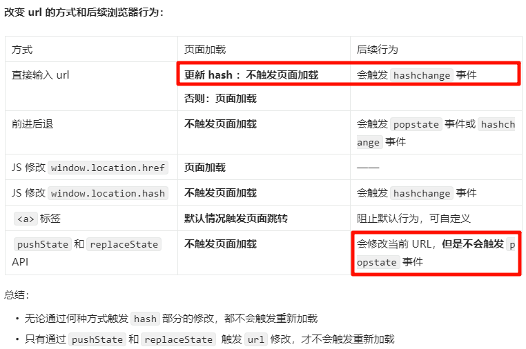

# Web_Router_Core

Web_Router_Core aims to understand the principles of vue-router and react-router

# 前提



# Vanilla Router

## 基于 Hash

由于 url hash 部分的修改不会触发页面重新加载，因此可以直接使用`hashchange`事件来进行对应试图的更新

```js
// 注册hashchange事件
window.addEventListener("hashchange", handleHashChange);
// 注册DOMContentLoaded事件，在页面第一次加载时渲染正确视图
window.addEventListener("DOMContentLoaded", handleHashChange);

function handleHashChange() {
    switch (location.hash) {
        case "#/home":
            // 渲染对应视图
            routerView.innerHTML = "HOME";
            break;
        case "#/about":
            routerView.innerHTML = "About";
            break;
        default:
            return;
    }
}
```

值得注意的一点：首次页面加载时要触发视图同步，因此需要额外监听`DOMContentLoaded`事件。

扩展：`DOMContentLoaded`事件在 HTML 完全解析（即所有延迟脚本下载和执行完毕后触发），而`load`事件还会等待图片，样式表等资源加载完毕后触发。因此视图同步在`DOMContentLoaded`事件触发时执行能够尽量减少白屏时间

## 基于 History

触发 url 修改而不重新加载页面的的方式只有 JS 调用 `pushState`和`replaceState` API，因此所有触发页面重新加载的方式都需要被重写为`pushState`和`replaceState` API。

然而有两种方式是无法重写的：

-   输入 url
-   JS 修改`window.location.href`

因此这将是 history 模式下跳转的其他 url 的后门，所以在 history 模式下主要处理：前进后退、`<a>`标签

而 `pushState`和`replaceState` API 将作为触发`popstate`事件触发视图同步的扳机

```ts
// 页面加载时：重写a标签点击逻辑；同步试图
window.addEventListener("DOMContentLoaded", handleContentLoaded);
// 前进后退时触发视图更新
window.addEventListener("popstate", syncView);

function handleContentLoaded() {
    // 重写a标签点击事件
    const linkList = document.querySelectorAll("a");
    function handleLinkClick(e: Event) {
        // 阻止默认行为
        e.preventDefault();
        // 修改url
        history.pushState(
            null,
            "",
            (e.target as Element)?.getAttribute("href")
        );
        // 触发视图更新
        syncView();
    }
    linkList.forEach((el) => {
        el.addEventListener("click", handleLinkClick);
    });

    // 首次加载同步视图
    syncView();
}

function syncView() {
    switch (location.pathname) {
        case "/home":
            routerView.innerHTML = "Home";
            return;
        case "/about":
            routerView.innerHTML = "About";
            return;
        default:
            return;
    }
}
```

# React Router

## 基于 Hash

首先是使用方式：

```tsx
const App = () => {
    return (
        <>
            <h1>{import.meta.env.VITE_HASH ? "Hash" : "History"}</h1>
            <Link to="/home">Home</Link>
            <br />
            <Link to="/about">About</Link>
            <br />
            <RouteView path="/home" render={() => <div>Home</div>} />
            <RouteView path="/about" render={() => <div>About</div>} />
        </>
    );
};

root.render(
    <Router>
        <App />
    </Router>
);
```

因此需要封装组件：

-   `Router`
    -   提供当前 url hash;
    -   绑定`hashchange`事件
-   `Link`
    -   修改 url，hash 模式直接利用`<a>`的 href 属性即可
-   `RouteView`
    -   组件展示容器，path 和 url 匹配则渲染对应组件
    -   需要消费`Router`提供的 hash

实现：
`Router`实际上是一个`Provider`

```tsx
import {
    createContext,
    ReactNode,
    useContext,
    useEffect,
    useState,
} from "react";

interface HashContext {
    hash: string;
}
const HashContext = createContext<HashContext | null>(null);

export const useHashContext = () => {
    const context = useContext(HashContext);
    return context?.hash;
};

const Router: React.FC<{ children: ReactNode }> = ({ children }) => {
    const [hash, setHash] = useState<string>(window.location.hash);

    useEffect(() => {
        // 注册hashchange
        function handleHashChange() {
            setHash(window.location.hash);
        }
        window.addEventListener("hashchange", handleHashChange);

        return () => {
            window.removeEventListener("hashchange", handleHashChange);
        };
    }, []);

    return (
        <HashContext.Provider value={{ hash }}>{children}</HashContext.Provider>
    );
};

export default Router;
```

`Link` 组件就是普调的`<a>`标签，href 属性为 hash 路径

```tsx
interface LinkProps {
    to: string;
    children: React.ReactNode;
}
const Link: React.FC<LinkProps> = ({ to, children }) => {
    return <a href={"#" + to}>{children}</a>;
};

export default Link;
```

`RouteView` 组件判断 url 的 hash 和指定的 path 是否匹配来渲染对应组件

```tsx
import { useHashContext } from "./Router";

interface RouteViewProps {
    path: string;
    render: () => React.ReactNode;
}
const RouteView: React.FC<RouteViewProps> = ({ path, render }) => {
    const hash = useHashContext();
    return hash === "#" + path ? render() : null;
};

export default RouteView;
```

## 基于 History

使用方式和 Hash 相同

**主要不同是：History 模式下触发 url 修改需要 `pushState`，但是这个方法不会触发任何事件，因此需要主动触发视图更新，那么就需要提供触发的方法给`Link`组件**

`Router`：

```tsx
import {
    createContext,
    ReactNode,
    useContext,
    useEffect,
    useState,
} from "react";

interface HistoryContext {
    href: string;
+    syncView: () => void;
}
const HistoryContext = createContext<HistoryContext | null>(null);

export const useHistoryContext = () => {
    const context = useContext(HistoryContext);
+    return { href: context?.href, syncView: context?.syncView };
};

const HistoryRouter: React.FC<{ children: ReactNode }> = ({ children }) => {
    const [href, setHash] = useState<string>(window.location.href);

    function handlePopState() {
        setHash(window.location.href);
    }
    useEffect(() => {
        // 注册popstate
        window.addEventListener("popstate", handlePopState);

        return () => {
            window.removeEventListener("popstate", handlePopState);
        };
    }, []);

    return (
+        <HistoryContext.Provider value={{ href, syncView: handlePopState }}>
            {children}
        </HistoryContext.Provider>
    );
};

export default HistoryRouter;
```

`Link`: 阻止默认行为；修改 url；触发视图更新

```tsx
import { useHistoryContext } from "./Router";

interface LinkProps {
    to: string;
    children: React.ReactNode;
}
const Link: React.FC<LinkProps> = ({ to, children }) => {
+    const { syncView } = useHistoryContext();

+    function handleLinkClick(e: React.MouseEvent<HTMLAnchorElement>) {
+        e.preventDefault();
+        window.history.pushState(null, "", to);
+        syncView?.();
+    }
    return (
        <a href={to} onClick={handleLinkClick}>
            {children}
        </a>
    );
};

export default Link;
```

`RouteView`: 功能没有变化，都是匹配 url 和 path prop 决定是否渲染

```tsx
import { useHistoryContext } from "./Router";

interface RouteViewProps {
    path: string;
    render: () => React.ReactNode;
}
const RouteView: React.FC<RouteViewProps> = ({ path, render }) => {
    const { href } = useHistoryContext();
    const curHref = href?.slice(
        window.location.origin.length,
        window.location.origin.length + path.length
    );
    return curHref === path ? render() : null;
};

export default RouteView;
```
