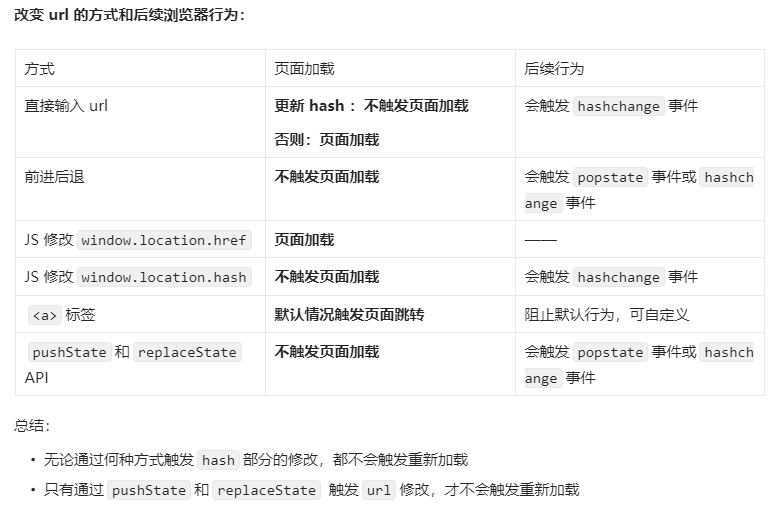

# Web_Router_Core

Web_Router_Core aims to understand the principles of vue-router and react-router

# 前提



# Vanilla Router

## 基于 Hash

由于 url hash 部分的修改不会触发页面重新加载，因此可以直接使用`hashchange`事件来进行对应试图的更新

```js
// 注册hashchange事件
window.addEventListener("hashchange", handleHashChange);
// 注册DOMContentLoaded事件，在页面第一次加载时渲染正确视图
window.addEventListener("DOMContentLoaded", handleHashChange);

function handleHashChange() {
    switch (location.hash) {
        case "#/home":
            // 渲染对应视图
            routerView.innerHTML = "HOME";
            break;
        case "#/about":
            routerView.innerHTML = "About";
            break;
        default:
            return;
    }
}
```

值得注意的一点：首次页面加载时要触发视图同步，因此需要额外监听`DOMContentLoaded`事件。

扩展：`DOMContentLoaded`事件在 HTML 完全解析（即所有延迟脚本下载和执行完毕后触发），而`load`事件还会等待图片，样式表等资源加载完毕后触发。因此视图同步在`DOMContentLoaded`事件触发时执行能够尽量减少白屏时间

## 基于 History

触发 url 修改而不重新加载页面的的方式只有 JS 调用 `pushState`和`replaceState` API，因此所有触发页面重新加载的方式都需要被重写为`pushState`和`replaceState` API。

然而有两种方式是无法重写的：

-   输入 url
-   JS 修改`window.location.href`

因此这将是 history 模式下跳转的其他 url 的后门，所以在 history 模式下主要处理：前进后退、`<a>`标签

而 `pushState`和`replaceState` API 将作为触发`popstate`事件触发视图同步的扳机

```ts
// 页面加载时：重写a标签点击逻辑；同步试图
window.addEventListener("DOMContentLoaded", handleContentLoaded);
// 前进后退时触发视图更新
window.addEventListener("popstate", syncView);

function handleContentLoaded() {
    // 重写a标签点击事件
    const linkList = document.querySelectorAll("a");
    function handleLinkClick(e: Event) {
        // 阻止默认行为
        e.preventDefault();
        // 修改url
        history.pushState(
            null,
            "",
            (e.target as Element)?.getAttribute("href")
        );
        // 触发视图更新
        syncView();
    }
    linkList.forEach((el) => {
        el.addEventListener("click", handleLinkClick);
    });

    // 首次加载同步视图
    syncView();
}

function syncView() {
    switch (location.pathname) {
        case "/home":
            routerView.innerHTML = "Home";
            return;
        case "/about":
            routerView.innerHTML = "About";
            return;
        default:
            return;
    }
}
```
